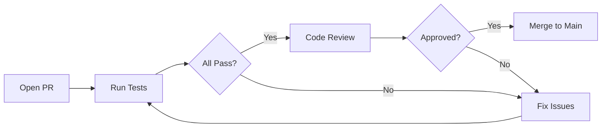
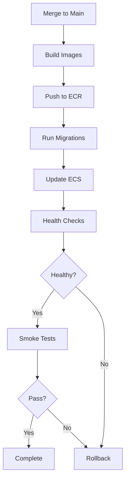

# CI/CD Pipeline Documentation

Comprehensive Continuous Integration and Continuous Deployment pipeline for the SAR Tasking Platform.

## Overview

The CI/CD pipeline consists of multiple automated workflows that ensure code quality, security, and reliable deployments.

```
┌─────────────────────────────────────────────────────┐
│              CI/CD Pipeline Flow                    │
├─────────────────────────────────────────────────────┤
│                                                     │
│  Pull Request → PR Validation → Merge to Main      │
│                      ↓                              │
│                 ✓ Backend Tests                     │
│                 ✓ Frontend Tests                    │
│                 ✓ Go Service Tests                  │
│                 ✓ Python Service Tests              │
│                 ✓ E2E Tests                         │
│                 ✓ Security Scans                    │
│                 ✓ Build Validation                  │
│                                                     │
│  Main Branch → Docker Build → Security Scan        │
│                      ↓                              │
│                 Build & Push Images                 │
│                      ↓                              │
│                 Scan for Vulnerabilities            │
│                      ↓                              │
│  Deploy → AWS ECS → Smoke Tests → Monitor          │
│                                                     │
└─────────────────────────────────────────────────────┘
```

## Workflows

### 1. PR Validation (`pr-validation.yml`)

**Triggers:**
- Pull requests to `main` or `develop`
- Push to `main` or `develop`

**Jobs:**
- ✅ **Backend Tests**: Unit tests, linting, Prisma migrations
- ✅ **Frontend Tests**: Component tests, linting, build validation
- ✅ **Go Service Tests**: Unit tests, linting, build
- ✅ **Python Service Tests**: Unit tests, type checking, linting
- ✅ **E2E Tests**: Full-stack integration tests with Playwright
- ✅ **Security Scan**: Vulnerability scanning with Trivy
- ✅ **Code Quality**: SonarCloud analysis
- ✅ **Build Validation**: Docker build tests for all services

**Duration:** ~15-20 minutes

**Requirements for Merge:**
- All tests passing
- No critical security vulnerabilities
- Build successful for all services

### 2. Docker Build (`docker-build.yml`)

**Triggers:**
- Push to `main`
- Git tags matching `v*.*.*`
- Manual workflow dispatch

**Jobs:**
- 🐳 **Build and Push**: Multi-architecture builds (amd64, arm64)
- 🔍 **Scan Images**: Trivy vulnerability scanning
- 📦 **Generate SBOM**: Software Bill of Materials
- 📝 **Update Manifests**: Update Kubernetes deployment files
- 📢 **Notifications**: Slack notifications

**Features:**
- Multi-stage builds for optimal image size
- Layer caching for faster builds
- Semantic versioning support
- SBOM generation for compliance

**Output:**
- Images pushed to GitHub Container Registry (ghcr.io)
- Tagged with: `latest`, `main`, `sha-{commit}`, `v{version}`

### 3. Deploy (`deploy.yml`)

**Triggers:**
- Manual workflow dispatch with environment selection
- Automatic deployment on push to `main` (development)

**Environments:**
- Development
- Staging
- Production

**Jobs:**
- 🚀 **Deploy**: Build, push to ECR, update ECS services
- 🧪 **Smoke Tests**: Post-deployment health checks
- 🔄 **Rollback**: Automatic rollback on failure

**Deployment Steps:**
1. Configure AWS credentials
2. Build and push images to ECR
3. Run database migrations
4. Update ECS services
5. Wait for service stability
6. Run health checks
7. Execute smoke tests

**Rollback Strategy:**
- Automatic rollback on deployment failure
- Reverts to previous task definition
- Notifications sent to Slack

### 4. Security (`security.yml`)

**Triggers:**
- Push to `main` or `develop`
- Pull requests
- Daily schedule (2 AM UTC)
- Manual workflow dispatch

**Scans:**

#### Dependency Scanning
- npm audit (Backend & Frontend)
- Snyk vulnerability scanning
- License compliance checking

#### Static Analysis
- CodeQL for JavaScript, Python, Go
- Semgrep SAST scanning
- Security and quality queries

#### Secret Scanning
- TruffleHog for credential detection
- GitLeaks for secret leakage

#### Container Scanning
- Trivy for container vulnerabilities
- Grype for additional scanning
- Multi-layer analysis

#### Infrastructure Scanning
- Checkov for IaC security
- Terraform validation
- Dockerfile best practices

#### Compliance
- OSSF Scorecard
- License compatibility
- Security posture assessment

**Outputs:**
- SARIF results uploaded to GitHub Security tab
- Automated issue creation on failures
- Security summary in workflow results

## Setup Instructions

### 1. Required Secrets

Add these secrets to your GitHub repository:

#### AWS Credentials
```
AWS_ACCOUNT_ID          # AWS account ID
AWS_ROLE_ARN            # IAM role ARN for GitHub Actions
AWS_REGION              # AWS region (e.g., us-east-1)
PRIVATE_SUBNET_IDS      # Comma-separated subnet IDs
ECS_SECURITY_GROUP      # ECS security group ID
```

#### Container Registry
```
GITHUB_TOKEN            # Automatically provided by GitHub
```

#### External Services (Optional)
```
SNYK_TOKEN             # Snyk API token
SONAR_TOKEN            # SonarCloud token
SLACK_WEBHOOK          # Slack webhook URL for notifications
GITLEAKS_LICENSE       # GitLeaks license key
```

### 2. GitHub Actions Permissions

Ensure the following permissions in repository settings:

**Settings → Actions → General:**
- ✅ Read and write permissions
- ✅ Allow GitHub Actions to create pull requests

**Settings → Code security:**
- ✅ Code scanning (CodeQL)
- ✅ Dependency graph
- ✅ Dependabot alerts
- ✅ Secret scanning

### 3. AWS IAM Setup

Create an IAM role for GitHub Actions with OIDC:

```json
{
  "Version": "2012-10-17",
  "Statement": [
    {
      "Effect": "Allow",
      "Principal": {
        "Federated": "arn:aws:iam::ACCOUNT_ID:oidc-provider/token.actions.githubusercontent.com"
      },
      "Action": "sts:AssumeRoleWithWebIdentity",
      "Condition": {
        "StringLike": {
          "token.actions.githubusercontent.com:sub": "repo:ORG/REPO:*"
        }
      }
    }
  ]
}
```

**Required Permissions:**
- ECS: Full access
- ECR: Read/Write
- ELB: Read
- RDS: Connect (for migrations)
- Secrets Manager: Read

### 4. Container Registry Setup

**GitHub Container Registry (ghcr.io):**
```bash
# Login locally
echo $GITHUB_TOKEN | docker login ghcr.io -u USERNAME --password-stdin

# Pull images
docker pull ghcr.io/ORG/sar-tasking-backend:latest
```

### 5. Environment Configuration

Create environment-specific configurations in GitHub:

**Settings → Environments:**

- **development**
  - Auto-deploy on push to main
  - No approval required

- **staging**
  - Manual approval required
  - Protection rules: 1 reviewer

- **production**
  - Manual approval required
  - Protection rules: 2 reviewers
  - Deployment branch: main only

## Workflow Diagrams

### PR Workflow


### Deployment Workflow


## Best Practices

### Testing
- ✅ Write tests for all new features
- ✅ Maintain >70% code coverage
- ✅ Run tests locally before pushing
- ✅ Fix failing tests immediately

### Security
- ✅ Never commit secrets
- ✅ Use environment variables
- ✅ Keep dependencies updated
- ✅ Review security scan results
- ✅ Fix critical vulnerabilities ASAP

### Deployment
- ✅ Test in development first
- ✅ Run database migrations separately
- ✅ Monitor deployment progress
- ✅ Verify health checks pass
- ✅ Have rollback plan ready

### Code Quality
- ✅ Follow linting rules
- ✅ Write clear commit messages
- ✅ Keep PRs small and focused
- ✅ Document significant changes
- ✅ Address code review comments

## Monitoring & Notifications

### Slack Notifications

Configure Slack webhook for notifications:

```yaml
# Add to repository secrets
SLACK_WEBHOOK: https://hooks.slack.com/services/YOUR/WEBHOOK/URL
```

**Notifications sent for:**
- Deployment status (success/failure)
- Security scan failures
- Build failures on main branch

### GitHub Status Checks

Required status checks before merge:
- Backend Tests
- Frontend Tests
- Build Validation
- Security Scan

### Metrics & Insights

**GitHub Insights:**
- View workflow run history
- Track success/failure rates
- Monitor execution times
- Analyze bottlenecks

**Access:** Repository → Actions → Workflows

## Troubleshooting

### Common Issues

#### Tests Failing Locally But Pass in CI
```bash
# Ensure clean environment
docker-compose down -v
docker-compose up --build

# Run with same Node version as CI
nvm use 22
```

#### Build Timeouts
```yaml
# Increase timeout in workflow
timeout-minutes: 30
```

#### Deployment Failures
```bash
# Check ECS service events
aws ecs describe-services --cluster sar-tasking-cluster --services sar-tasking-backend-prod

# Check CloudWatch logs
aws logs tail /ecs/sar-tasking-backend --follow
```

#### Permission Errors
```bash
# Verify IAM role permissions
aws sts get-caller-identity

# Check assume role policy
aws iam get-role --role-name GitHubActionsRole
```

### Debug Mode

Enable debug logging:

**Repository Settings → Secrets:**
```
ACTIONS_RUNNER_DEBUG=true
ACTIONS_STEP_DEBUG=true
```

## Performance Optimization

### Caching Strategies

**Node modules:**
```yaml
- uses: actions/setup-node@v4
  with:
    cache: 'npm'
```

**Docker layers:**
```yaml
- uses: docker/build-push-action@v5
  with:
    cache-from: type=gha
    cache-to: type=gha,mode=max
```

### Parallel Execution

Matrix builds for services:
```yaml
strategy:
  matrix:
    service: [backend, frontend, go-service, python-service]
```

### Conditional Execution

Skip workflows on documentation changes:
```yaml
on:
  push:
    paths-ignore:
      - '**.md'
      - 'docs/**'
```

## Cost Optimization

### GitHub Actions Minutes

**Free tier limits:**
- Public repos: Unlimited
- Private repos: 2,000 minutes/month

**Optimization:**
- Use caching extensively
- Run expensive tests conditionally
- Parallelize jobs
- Skip redundant workflows

### AWS Costs

- Use Fargate Spot for non-production
- Implement auto-scaling
- Stop unused environments
- Use Reserved Instances for production

## Compliance & Auditing

### Audit Logs
- All deployments logged
- GitHub Actions logs retained
- AWS CloudTrail enabled
- Security scan results archived

### Compliance Reports
- SBOM generation
- Vulnerability reports
- License compliance
- Security scorecard

## Future Enhancements

- [ ] Canary deployments
- [ ] Blue-green deployments
- [ ] Progressive rollouts
- [ ] Feature flags integration
- [ ] Performance testing in CI
- [ ] Chaos engineering tests
- [ ] Multi-region deployments
- [ ] Automated security patching

## Support

For CI/CD issues:
1. Check workflow run logs
2. Review troubleshooting section
3. Check GitHub Actions status
4. Contact DevOps team
